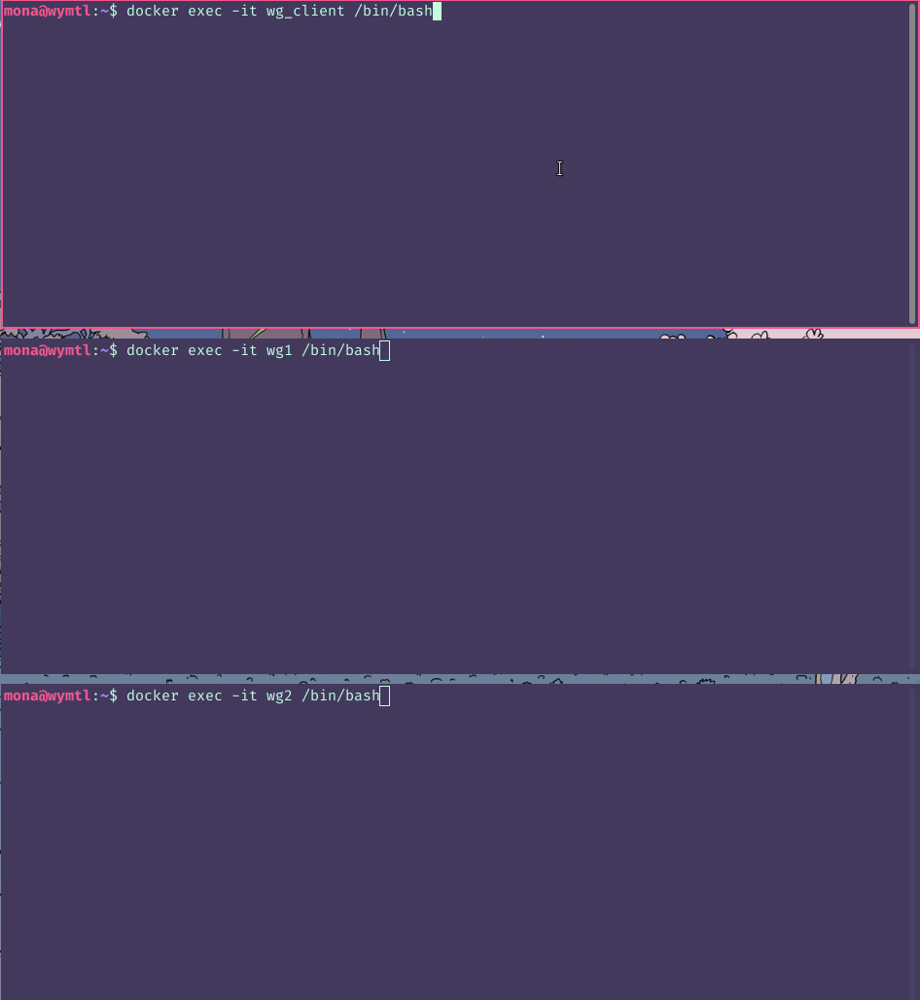

# quic-migrate
Exploring intentional connection migration over QUIC

#### Note from June 2022
Note that this demo was developed largely in 2019-2020. At that point in time, no QUIC client libraries supported automatic connection migration; however, Chromium's QUIC library had connection migration support, even if the toy server and client did not support automatic connection migration. The reason this demo is very involved is because it involves building a patch into Chromium's toy client and server to support (theoretically optimal) automatic connection migration. This is adapted from patches from prior work in MIMIQ, which is linked below as well.

As of late 2021, after the large part of this work had already been done, the toy server and client now support automatic connection migration natively, so it is likely that the patching steps below are no longer necessary. However, our team has not yet tested this with the code we use below to perform the QUIC migration demo.

## Build

Dependencies:
 * bash
 * git
 * docker-compose v1.27.4
 * all dependencies from [Chromium Build for Linux](https://chromium.googlesource.com/chromium/src/+/main/docs/linux/build_instructions.md)

Most notably, even though we are not building the entire Chromium browser (just the QUIC binaries), we still need to download the entire source in order to patch it properly. On our machines, we had approximately 50 GB of free disk space to do this with.

This demo and code setup is the most involved. If you are curious why, see the "Why the Chromium QUIC server/client?" section at the end. In this project, we patch and build Chromium libraries *outside* the context of a Docker container (since the source is so large) and on the host device.

We consulted these tutorials extensively for the above process, if you run into any trouble:
 * [Chromium Build for Linux](https://chromium.googlesource.com/chromium/src/+/main/docs/linux/build_instructions.md)
 * [Building Old Revisions](https://chromium.googlesource.com/chromium/src/+/master/docs/building_old_revisions.md)
 * [Working with Release Branches](https://www.chromium.org/developers/how-tos/get-the-code/working-with-release-branches/)

### Patching and building Chromium toy server and client

To build the Chromium source with modified QUIC client, since their default toy client [does not support connection migration](https://bugs.chromium.org/p/chromium/issues/detail?id=1104647). The following steps are adapted from the build and experiment instructions from MIMIQ ([paper](https://www.usenix.org/system/files/foci20-paper-govil.pdf), [code](https://github.com/liangw89/p4privacy/blob/master/mimiq/walkthrough)).

Note that this step requires a large amount of disk space due to the size of the Chromium git repository. However, the build process is not too long since we are only building `quiche` (their QUIC library) tooling.

To download and apply the patches, run:

```
./chromium-setup.sh
```

Then once `$CHROMIUM_SRC_DIR` is set, you can run 
```
docker-compose build && docker-compose up
```
to bring up the network. The first run will take a little bit of time as the server and client containers should attempt to build the quic binaries from the chromium source.


#### Why the Chromium QUIC server/client?

It's a hassle to build (especially into a Docker container) since it requires the entire Chromium source and build chain, but it is the most mature QUIC library that supports connection migration.

### Testing migration

Running the following:
```
/src/out/Debug/quic_client --host=server --port=6121 --disable_certificate_verification https://www.example.org
```
should work in the `wg_client` container. You can run `tcpdump` on any of the containers to capture the result-- we prefer running at the server to capture traffic coming in from both IP addresses.



